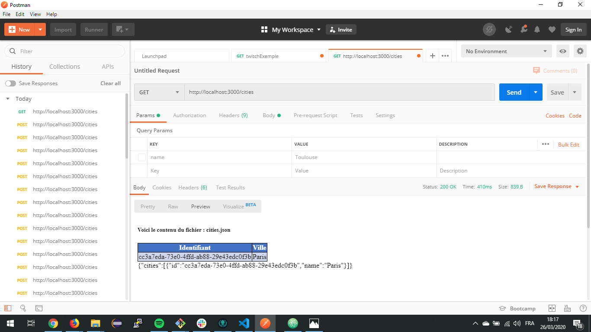
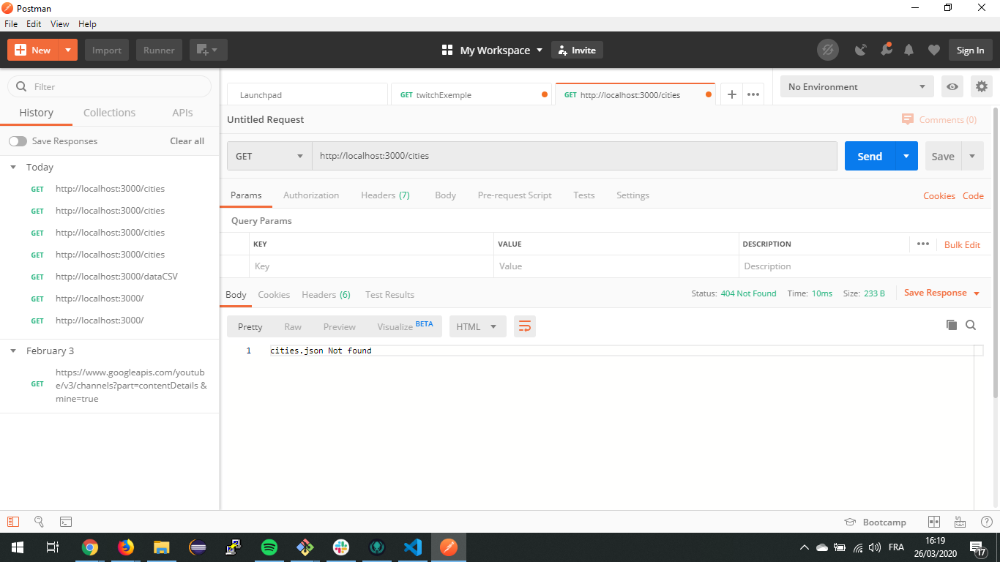
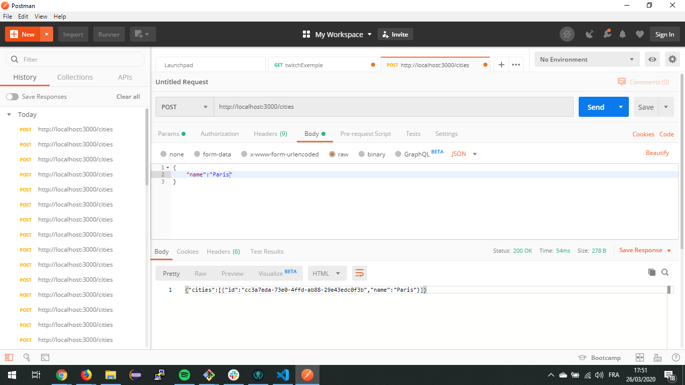
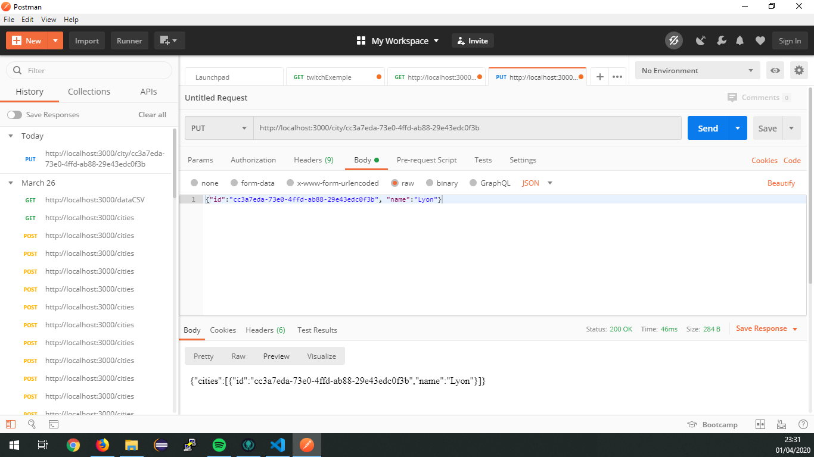
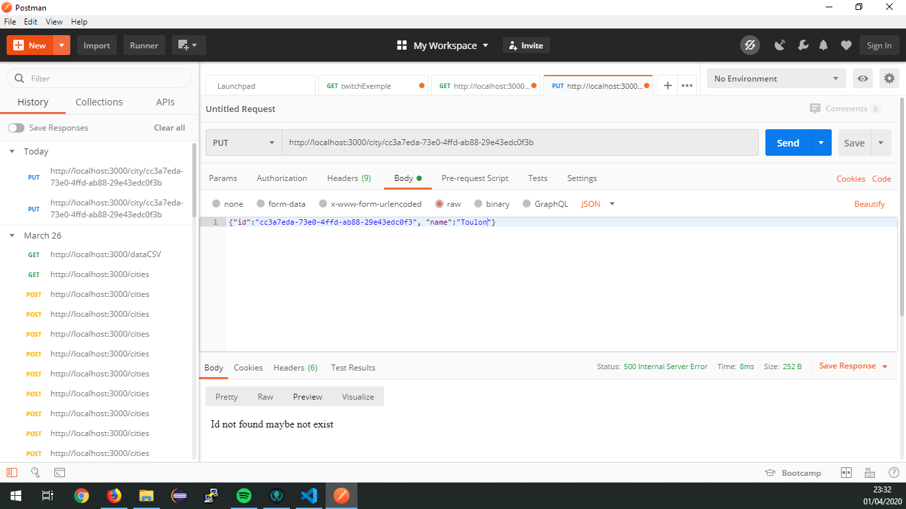
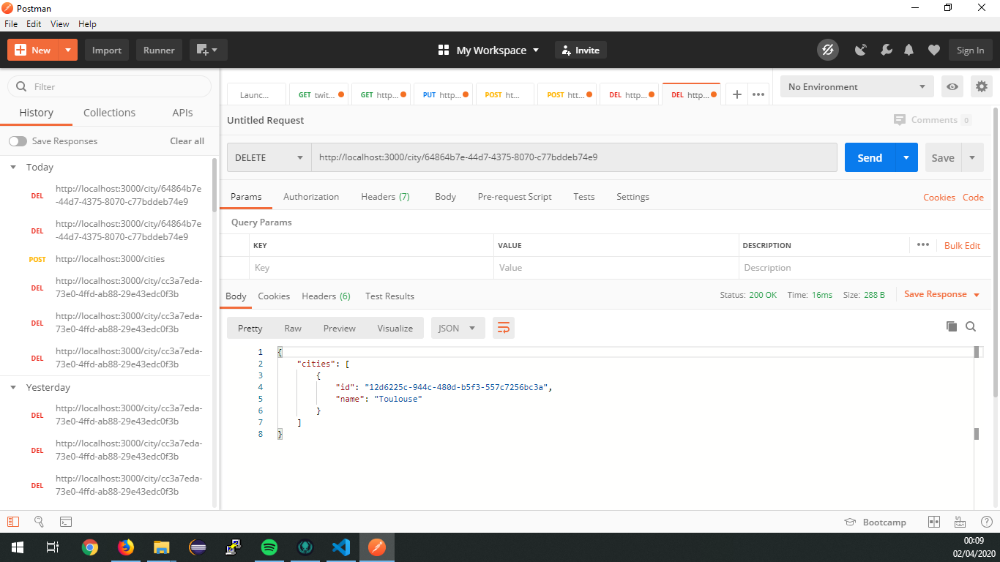
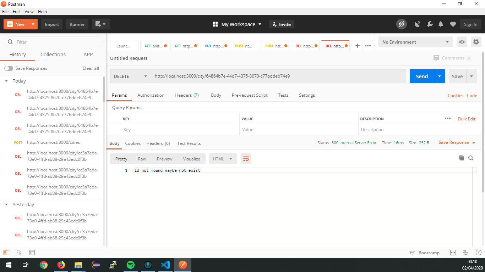
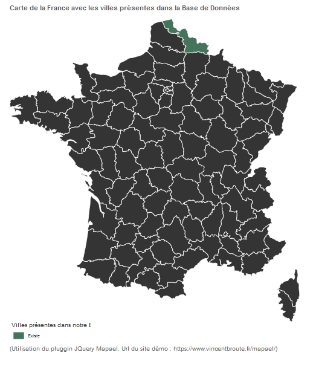
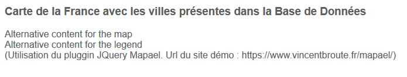

## TP 2 : Apprentissage de Express

Lancement du serveur : node .\Server.js .\data.csv

Dans ce TP il est question de reprendre le TP précédant, et de modifier l'existant avec un serveur Express.
J'ai donc tout d'abord crée le lien vers / pour l'index, puis /datacsv pour accèder à l'ancien affichage

Il nous a été ensuite demandé de rajouter les quatres requetes HTTP dont voici les retours de rêquetes associées (utilisation de Postman):

## Partie [GET]
## [GET] -> Return file cities.json

## [GET] -> Error files doesn't exist

## Partie [POST]
## [POST] -> cities.json not exist and Add element

## [POST] -> cities.json exist and Add element

## [POST] -> name already use

## Partie [PUT]
## [PUT] -> change name with existing id

## [PUT] -> change name with none existing id

## Partie [DELETE]
## [DELETE] -> delete entity with existing id

## [DELETE] -> delete entity with none existing id

## Partie Bonus

J'ai essayé d'ajouter une carte à l'adresse /citiesMap mais malheureusement je n'arrive pas à afficher le composant Map via express, même en passant par pug, ni même via un send file.
Le resultat attendu était:

Cette page est générée par mon html : Cours_2\Map_test\JQueryMap\france\front\testMap.html
note que je n'ai pas ajouté au code git mes essaies, il s'agissait d'une copie de la request GET avec un corps vide faisant juste appelle à mon fichier html.
Résultat dans mon serveur :

