## TP 2 : Apprentissage de MongoDB

Lancement du serveur : node .\Server.js

Dans ce TP il est question de reprendre le TP précédant, et de modifier l'existant avec une base de données MongoDB.

Il nous a été d'abord demandé de modifier nos requetes pour qu'elles utilisent la base MongoDB:

## Partie [GET]
## Affichage

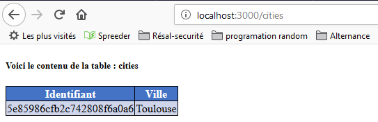

## Contenus dans la base

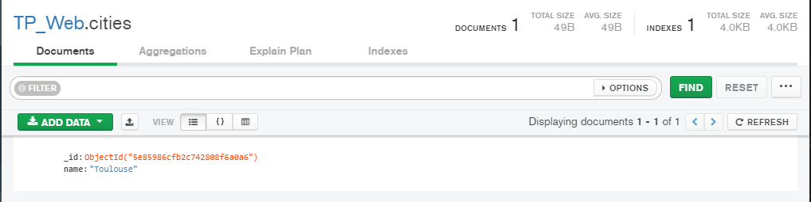

## Partie [POST]
## Ajout d'une ville

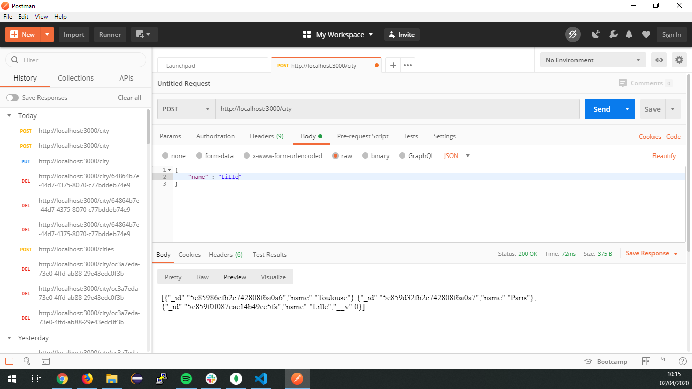

## Affichage (l'affiche retourne les données directes de la base)

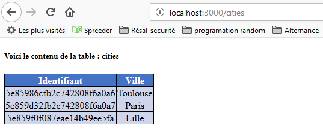

## Name déjà utilisé

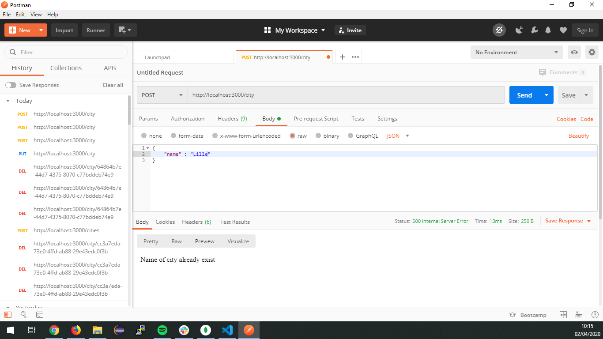

## Partie [PUT]
## Modification d'une ville

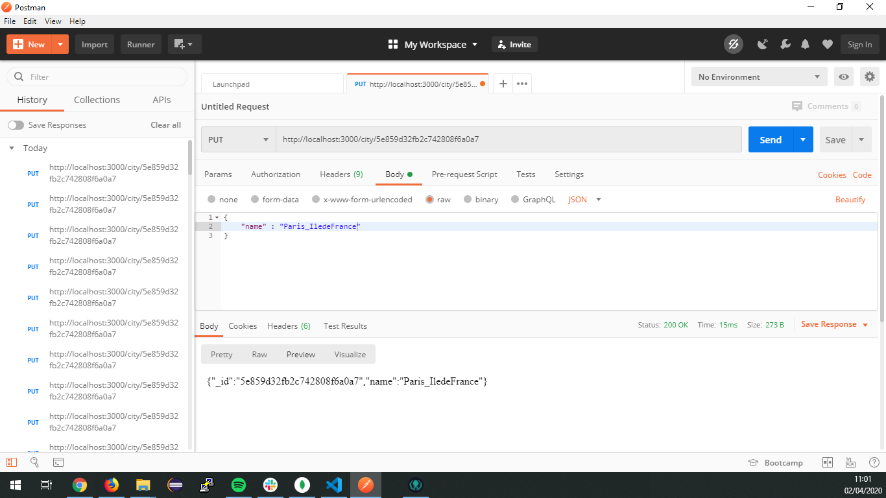

## Erreur si l'id n'est pas valide

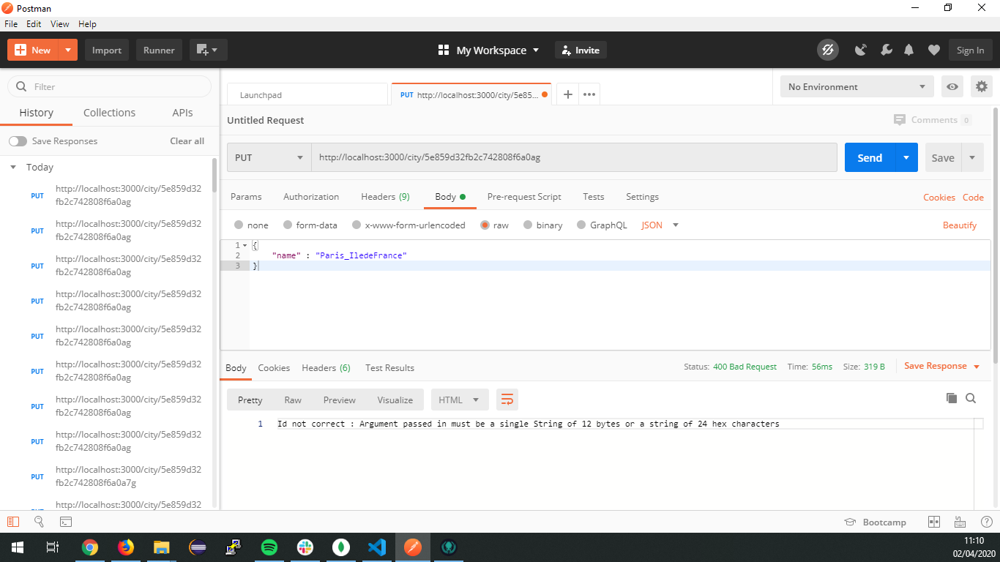

## Erreur si l'id n'existe pas

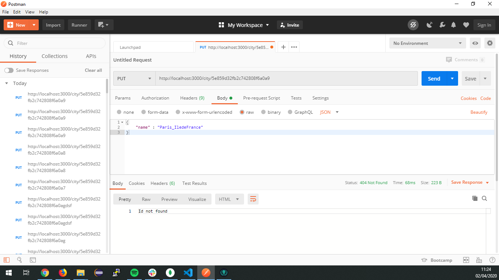

## Partie [DELETE]
## Etat de la base avant suppréssion

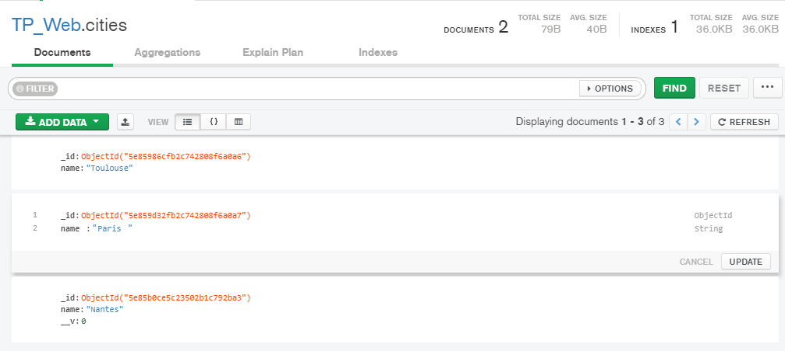

## Etat de la base après suppréssion

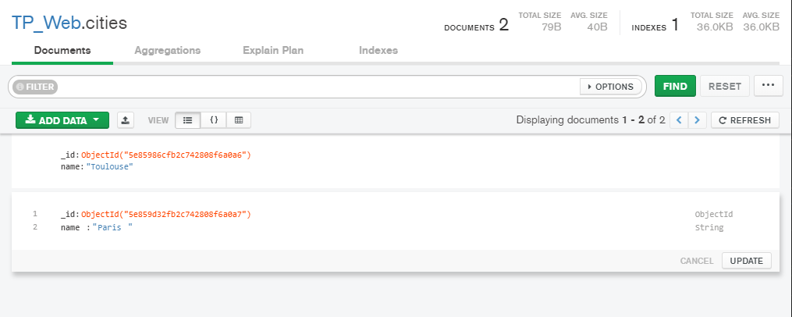

## Requête de suppréssion

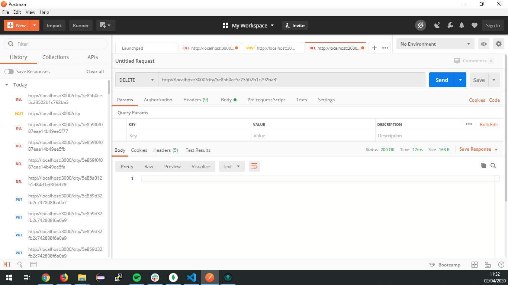

Maintenant il nous faut une interface servant à l'utilisateur pour réaliser les tâches.
Tout d'abord l'Ajout

## Partie [Ajout]
## Ajout du bouton ajout renvoyant vers /cityAjout

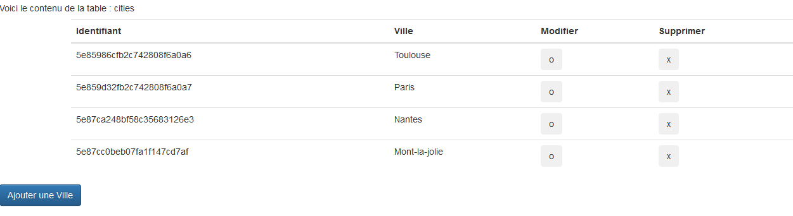

## Affichage du form pour renseigner le nom

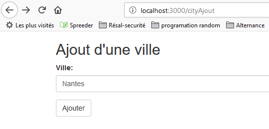

## Dans le cas d'une erreur, si le nom est déjà prit, une nouvelle page s'ouvre

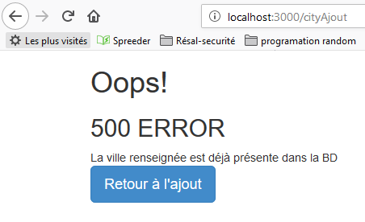

## Si le nom est valide :

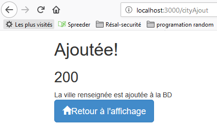

A présent, il nous faut modifier et supprimer un élément de notre table
J'ai ajouté deux nouvelles colonnes pour modifier ou supprimer
La modification ouvrira un modal contenant le nom en 'placeholder' à titre d'information

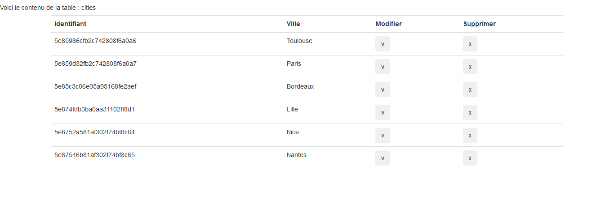
On clique sur modifier
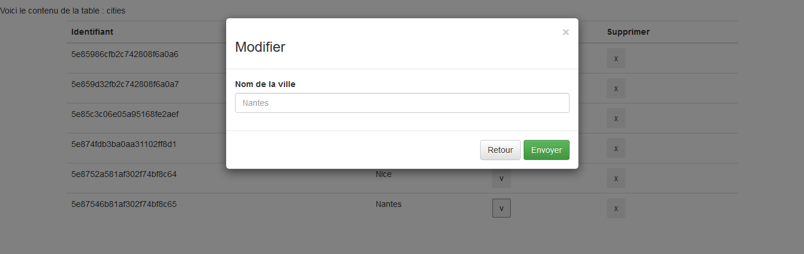
Si le nom est valide :
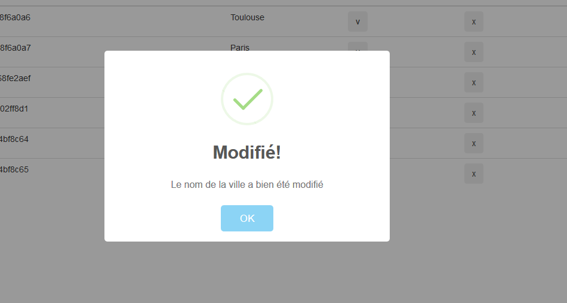
Sinon :
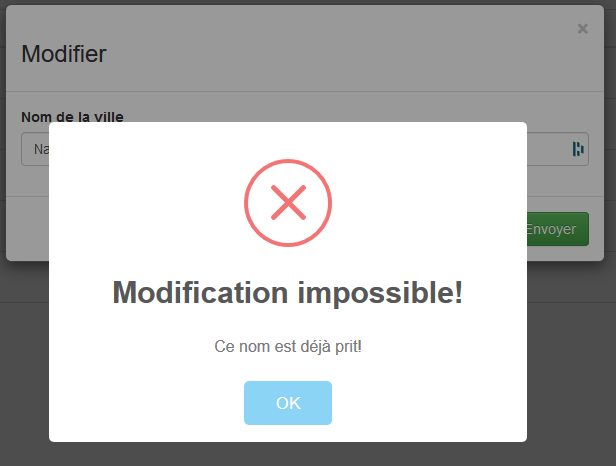

Le bouton ok aura pour effet de recharger la page pour la mettre à jour automatiquement
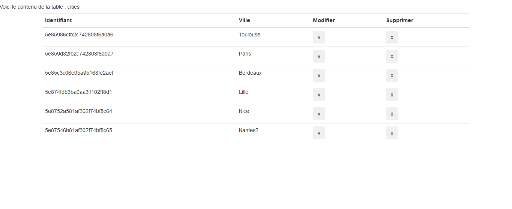

Pour la suppréssion on a le même principe, à la différence que cliquer implique directement l'action.
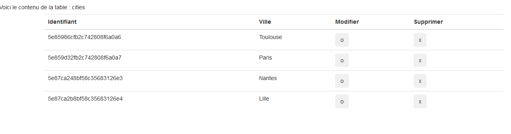

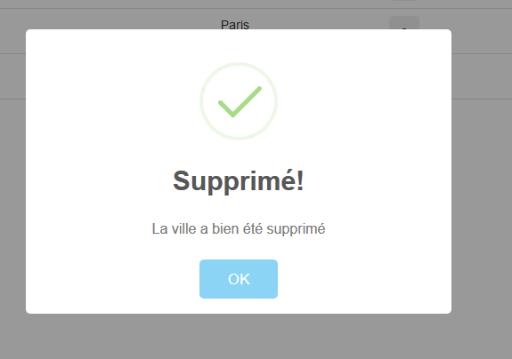

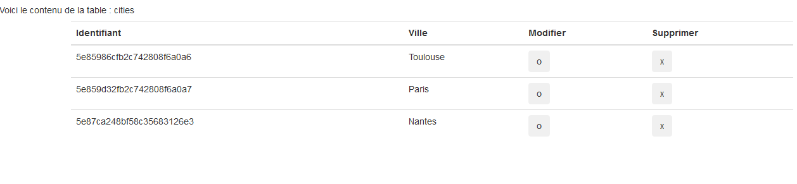
